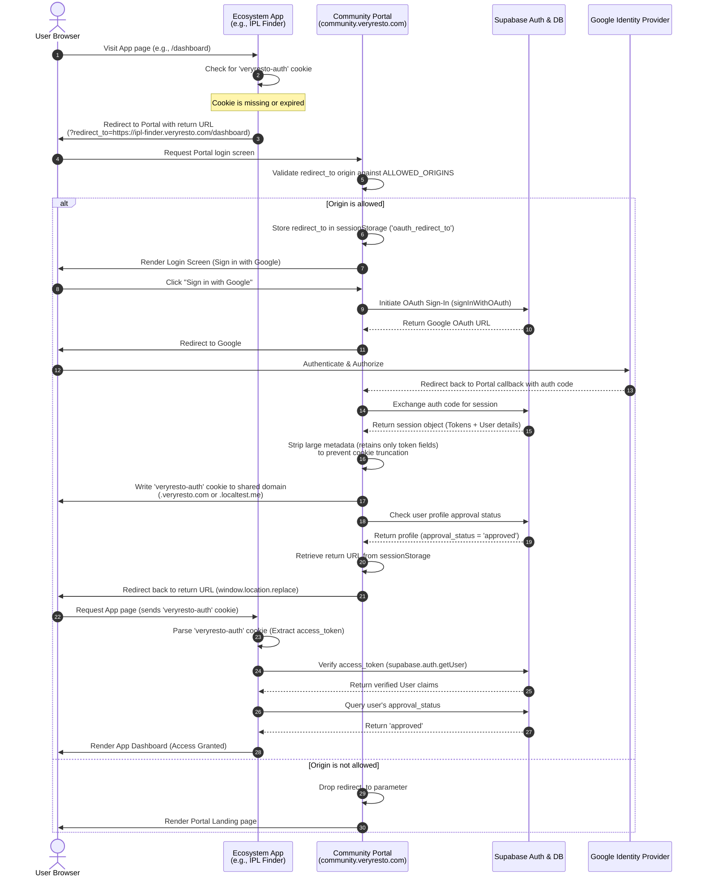
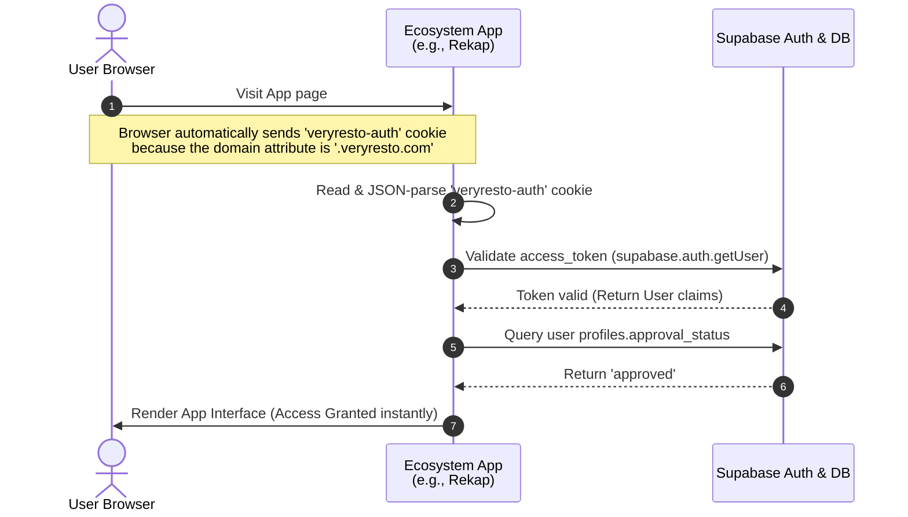
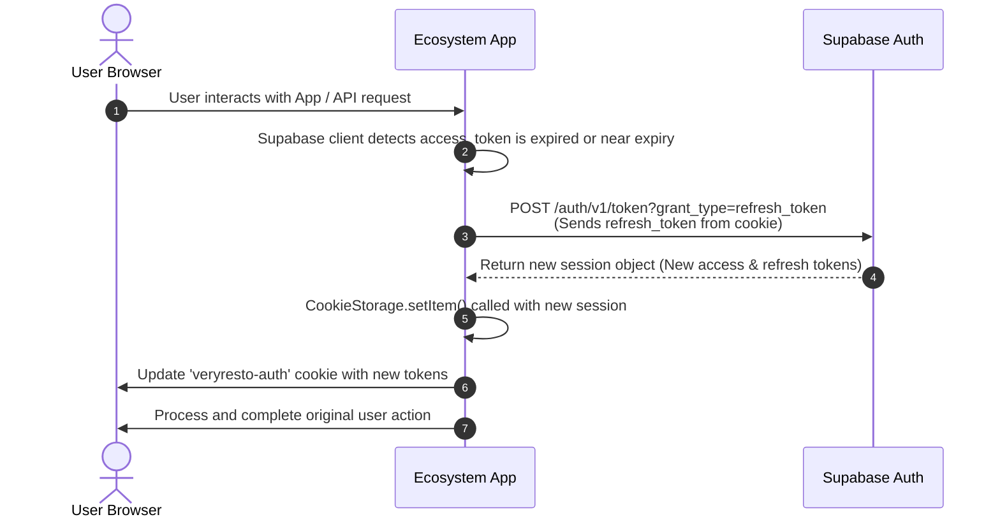
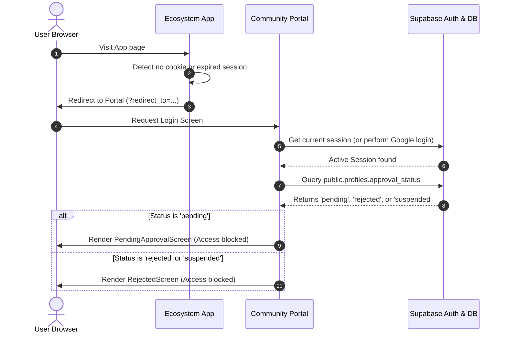

# Veryresto Authentication Sequence Diagrams

This document visualizes the authentication and authorization flow across the Veryresto ecosystem, as specified in the [Veryresto Identity Protocol](./veryresto-identity-protocol.md).

It details how the **Community Platform (Portal)** acting as the central Identity Provider (IdP) interacts with **Ecosystem Apps** (like IPL Finder, Rekap, etc.), **Supabase**, and the **Google OAuth** provider.

---

## 1. Initial Authentication & Cross-App Redirection
This flow describes what happens when an unauthenticated user visits an ecosystem app (e.g., `ipl-finder.veryresto.com`) and is redirected to the Portal for Google Sign-In before being returned to the app.

### Flow Highlights
1. **Redirect Allowlist Gate:** The Portal checks if the `redirect_to` origin is registered in `ALLOWED_ORIGINS` in [App.tsx](../src/App.tsx). Unregistered origins are ignored for security.
2. **Session Storage Persistence:** The callback URL is saved in the browser's `sessionStorage` because the OAuth redirection loop with Google wipes the query parameters.
3. **Cookie Strip Down:** The Portal custom `CookieStorage` (see [supabase.ts](../src/lib/supabase.ts)) strips down the Supabase session payload. It stores only the JWT and refresh token, keeping the cookie size well below the 4KB limit.
4. **App Verification Gate:** The target App reads the cookie, validates the JWT with Supabase, and checks the database for `approval_status = 'approved'`.

---

## 2. Silent Single Sign-On (SSO)
Once a user is logged in, they can access any other ecosystem app (e.g., `rekap.veryresto.com`) without seeing the login prompt or being redirected. This is achieved via shared cookie domain routing.

### Flow Highlights
- **No Redirect Loop:** The user is logged in seamlessly.
- **Shared Cookie Domain:** The browser attaches the cookie automatically because the Portal set the cookie domain to `.veryresto.com` (or `.localtest.me` in local dev).

---

## 3. Session Expiration & Silent Refresh
Supabase JWT access tokens typically expire in 1 hour. This diagram shows how the client library silently refreshes the session behind the scenes without user intervention.

### Flow Highlights
- **Background Refresh:** The official Supabase JS SDK (configured with `autoRefreshToken: true` and our custom `CookieStorage`) intercepts expired tokens and fetches new ones before making any database queries.
- **Shared Session Update:** Since the App writes the refreshed session back to the `.veryresto.com` cookie, other ecosystem apps instantly receive the updated session too.

---

## 4. Intercepting Pending / Rejected Users
If a user is authenticated but their registration is still pending review or has been rejected/suspended, they must be prevented from accessing ecosystem apps.

### Flow Highlights
- **Portal Gatekeeper:** The Portal blocks the redirection if the user profile is not `approved`. The user is stuck in the "Waiting Room" or "Rejected" screen.
- **App Gatekeeper (Secondary Layer):** Even if a user bypasses the Portal redirect somehow, the Ecosystem App queries `approval_status` directly. If the status is not `approved`, the App blocks access independently.

---

## Related Documents
- [Veryresto Identity Protocol](./veryresto-identity-protocol.md) - Platform-agnostic technical specification of the shared identity design.
- [Auth Integration Guide](./auth-integration-guide.md) - Guide for resident developers to integrate their applications.
- [React + Vite Auth Integration](./auth/react-vite.md) - Detailed guide for React/Vite/TypeScript stack integrations.
