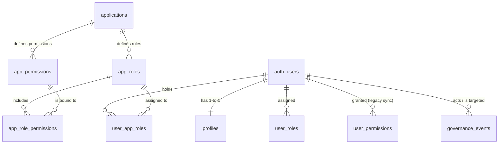

# Current Supabase Schema & Governance Architecture

This document describes the current architecture of the Supabase project, database schema, relationships, governance model, and permission system for the `community-portal`. It serves as the ground truth for future redesigns and platform evolution.

## 1. High-Level Architecture Overview

The `community-portal` utilizes Supabase for identity, authentication, and core relational data. The architecture implements a hybrid governance model featuring both Global RBAC (Role-Based Access Control) and App-Specific RBAC, alongside legacy compatibility layers.

*   **Supabase Auth**: Manages core identities, credentials, and sessions. Supabase owns the `auth.users` table.
*   **Profiles & Approval**: The platform extends identities via a `public.profiles` table, mapping 1-to-1 with `auth.users`. It tracks basic user information and, crucially, an `approval_status` ('pending', 'approved', 'suspended', 'rejected').
*   **Global Governance Roles**: Managed via the `user_roles` table, controlling ecosystem-wide privileges (e.g., `admin`, `resident_verifier`, `platform_moderator`).
*   **Decentralized Apps (App-RBAC)**: A structured capability system exists for specific ecosystem apps (e.g., `ipl_finder`). Apps, roles, permissions, and user mappings are stored relationally, allowing fine-grained access control on a per-app basis.
*   **Audit Logging**: The `governance_events` table maintains an immutable ledger of administrative actions and role assignments.
*   **Legacy Fallback**: A `user_permissions` table still exists to support older implementations (Phase 4 Strangler Pattern), synchronized dynamically via database triggers from the new App-RBAC model.

Supabase owns core identity and session states, while the platform strictly owns business logic, access governance, audit trails, and ecosystem role definitions.

---

## 2. Entity Relationship Diagram (ERD)



---

## 3. Table Inventory

### `profiles`
*   **Purpose**: Stores user profile metadata and global approval state. Maps 1-to-1 with Supabase's internal `auth.users`.
*   **Ownership**: Platform owns the data; populated automatically via a database trigger (`on_auth_user_created`) when a new user signs up in Supabase Auth.
*   **Important Columns**:
    *   `id` (UUID, PK): References `auth.users(id)`.
    *   `approval_status` (Enum): 'pending', 'approved', 'suspended', 'rejected'. Controls access to apps and global data.
    *   `house_number`, `whatsapp_number`, `full_name`, `avatar_url`: User identity details.
*   **Constraints**: Cascades on `auth.users` deletion.
*   **Semantics**: The `approval_status` defines the overarching relationship the user has with the community. "Pending" users are in a waiting room; "approved" users can participate in ecosystem apps.

### `user_roles`
*   **Purpose**: Manages global ecosystem roles.
*   **Important Columns**:
    *   `user_id` (UUID): References `auth.users(id)`.
    *   `role` (Enum `app_role`): e.g., 'admin', 'user', 'resident_verifier', 'platform_moderator'.
*   **Semantics**: Dictates high-level system privileges. An `admin` bypasses almost all RLS policies. `resident_verifier` and `platform_moderator` have specific scopes for managing approvals and users.

### `applications`
*   **Purpose**: Registry of decentralized apps in the ecosystem (e.g., 'ipl_finder').
*   **Important Columns**: `slug` (Unique), `name`, `url`.
*   **Semantics**: Acts as the namespace for application-specific governance and capabilities.

### `app_permissions` & `app_roles` & `app_role_permissions`
*   **Purpose**: Defines capability templates per application.
*   **Semantics**: 
    *   `app_permissions`: specific capabilities (e.g., 'read_files').
    *   `app_roles`: templates combining capabilities (e.g., 'resident', 'admin' specific to an app).
    *   `app_role_permissions`: binding table mapping permissions to roles.

### `user_app_roles`
*   **Purpose**: Maps a user to a specific role within a specific application.
*   **Semantics**: This is the active enforcement table for App-RBAC. E.g., User A holds the 'resident' role in 'ipl_finder'.

### `user_permissions` (Legacy)
*   **Purpose**: Legacy compatibility table mapping users to hardcoded permissions (`read_files`, `upload_files` as enums, though used mostly for `ipl_finder`).
*   **Semantics**: Currently kept strictly synchronized with `user_app_roles` via a Postgres trigger. Set to be sunset once Phase 5 cuts over entirely to dynamic App-RBAC.

### `governance_events`
*   **Purpose**: Immutable audit log of governance and role management actions.
*   **Important Columns**: `actor_user_id`, `target_user_id`, `action`, `reason`, `metadata` (JSONB).
*   **Semantics**: Acts as a ledger. Used for transparency and moderation accountability. Records role assignments, revocations, and manual moderation actions.

---

## 4. Current Approval / Governance Flow

1.  **Signup**: User signs up via Supabase Auth. Trigger `handle_new_user` inserts a row into `profiles` with basic metadata and defaults `approval_status` to `'pending'`.
2.  **Waiting Room**: The user's status remains 'pending'. RLS blocks access to apps like `applications`, `user_app_roles`, and restricted files.
3.  **Approval Process**: A user with `admin` or `resident_verifier` roles uses their platform manager capabilities to update the `profiles.approval_status` to `'approved'`.
4.  **Role Assignment**: Managers can assign `app_roles` (e.g., 'resident' for 'ipl_finder') via the `user_app_roles` table. 
5.  **Audit Logging**: The assignment into `user_app_roles` automatically triggers `log_user_app_role_governance()`, which inserts a record into `governance_events` outlining who did what.
6.  **Legacy Sync**: The same assignment triggers `sync_legacy_permissions()`, projecting the new capabilities into the `user_permissions` table.

---

## 5. Current RBAC Model

The current RBAC model operates in two distinct tiers:

*   **Global Roles (`user_roles`)**:
    *   `admin`: Absolute system administrator. Bypasses all application rules and policies.
    *   `resident_verifier`: Can approve pending residents and manage access mappings, but cannot alter the application registry itself.
    *   `platform_moderator`: Can manage and log governance events.
*   **App Roles (`app_roles` & `user_app_roles`)**:
    *   Scoped to specific applications. For example, `ipl_finder` has its own `resident` (read files) and `admin` (upload files) templates.
    *   Permissions (`app_permissions`) are evaluated via a namespaced resolution helper, e.g., evaluating if a user has `ipl_finder.upload_files`.

---

## 6. Current RLS Policies

RLS is heavily used across the platform to secure governance boundaries.

*   **Profiles**: 
    *   *Self-service update*: "Users can update own profile" - allows users to edit personal details, but relies on not overriding `approval_status`.
    *   *Delegated governance updates*: "Platform managers can update all profiles" - utilizes the `is_platform_manager()` helper so authorized staff can approve users.
*   **Governance Events**:
    *   Only users with `admin` or `resident_verifier` can select/view events.
    *   Authorized managers (plus `platform_moderator`) can insert new events.
*   **App-RBAC Ecosystem (`applications`, `app_roles`, etc.)**:
    *   "Approved residents can view..." - Global rule ensuring only profiles with `approval_status = 'approved'` can even see the application registry, capability list, and role templates.
    *   "Platform managers can manage application registry" - Only `admin` can create new apps or capabilities.
    *   "Platform managers can manage resident app role mappings" - `admin` and `resident_verifier` can map users to app roles.
*   **Legacy Files**:
    *   "Approved users can view files" - Checks if user has global `admin` OR the specific `read_files` permission via `has_permission()` helper.

---

## 7. Current Helper Functions / RPCs

*   **`has_namespaced_permission(user_id, namespaced_perm)`**:
    *   *Purpose*: The core dynamic privilege resolution engine.
    *   *Input/Output*: Takes a user UUID and string like `'ipl_finder.upload_files'`. Returns Boolean.
    *   *Business Meaning*: Looks up the user's assigned `app_roles` for the app slug and verifies if the capability template includes the requested permission. Automatically returns true for global `admin`s.
*   **`is_platform_manager(uid)`**:
    *   *Purpose*: Consolidates global governance checks.
    *   *Business Meaning*: Returns true if the user holds `admin`, `resident_verifier`, or `platform_moderator`. Used primarily in RLS for profile approvals.
*   **`has_role(_user_id, _role)` & `has_permission(_user_id, _permission)`**:
    *   *Purpose*: Legacy RLS helpers checking `user_roles` and `user_permissions` tables.
*   **`sync_legacy_permissions()` (Trigger)**:
    *   *Purpose*: Listens to `user_app_roles`. If a role changes for the `ipl_finder` app, it resolves the read/upload permissions and syncs them down to the legacy `user_permissions` table.
*   **`log_user_app_role_governance()` (Trigger)**:
    *   *Purpose*: Intercepts assignments to `user_app_roles` and strictly logs the action, app slug, role name, and actor to `governance_events`.

---

## 8. Current Auth Integration Model

The ecosystem currently relies on sibling-domain session sharing (often involving subdomains acting under a shared root domain).
*   **Supabase Auth session cookie** serves as the primary credential.
*   Apps like **Rekap Viewer** and **IPL Finder** act as clients to the central database, but they are subject to strict RLS policies ensuring that user data or specific capabilities cannot be loaded unless `approval_status` is verified or proper App-Roles exist.
*   Middleware in individual apps must respect and enforce these states, often checking the `has_namespaced_permission` RPC to authorize UI renders or server actions.

---

## 9. Current Known Limitations

*   **Naming Semantic Creep (`approval_status`)**: The status is binary/simple (`pending`/`approved`) but conflates "identity verification" with "community membership". 
*   **Resident-Centric Model**: Table columns (`house_number`) and roles (`resident_verifier`) assume all users are residents. Non-resident participants (e.g., external property managers, guests) are not natively modeled.
*   **Role Overlap & Ambiguity**: The distinction between global `user_roles` and app-specific `user_app_roles` can be confusing. An `admin` global role bypassing all App-RBAC policies is a massive hammer that limits the ability to have app-specific admins who are NOT global admins.
*   **Self-Service Vulnerabilities**: While `is_platform_manager` secures some updates, the basic `Profiles` RLS policy "Users can update own profile" does not explicitly restrict users from submitting payloads that modify their own `approval_status`, requiring strict validation layers on backend implementations.
*   **Legacy Burden**: The `user_permissions` synchronization introduces overhead and technical debt.

---

## 10. Suggested Evolution Areas (High-Level Only)

*   **Membership Abstraction**: Evolve from a strict "resident" concept to a broader "Membership" abstraction that can categorize participants (Resident, Tenant, External, Staff) without polluting the core profile.
*   **Decoupled Governance Scopes**: Migrate away from global `admin` bypasses. Adopt hierarchical governance where a "Global Admin" can assign "App Admins", but apps themselves handle their isolated RLS natively.
*   **Committee & Multi-Role Support**: Expand `app_roles` into complex grouping (e.g., Committee structures) that users can dynamically rotate in and out of.
*   **Formalize Off-Boarding**: Currently `suspended` and `rejected` exist, but formal off-boarding flows for users moving out of the community need clearer semantic states and role-revocation cascades.

---

## Appendix A — Raw RLS Policies

Below are the exact RLS policies in effect for the core governance tables to ensure security assumptions, update paths, and governance flows are not accidentally broken during future redesigns.

### `public.profiles`

```sql
CREATE POLICY "Users can view all profiles" 
ON public.profiles FOR SELECT 
USING (true);

CREATE POLICY "Users can insert own profile" 
ON public.profiles FOR INSERT 
WITH CHECK (auth.uid() = id);

CREATE POLICY "Users can update own profile" 
ON public.profiles FOR UPDATE 
USING (auth.uid() = id);

CREATE POLICY "Platform managers can update all profiles"
ON public.profiles FOR UPDATE
USING (public.is_platform_manager(auth.uid()));
```

### `public.user_roles` (Global Roles)

```sql
CREATE POLICY "Admins can view all roles"
ON public.user_roles FOR SELECT
USING (public.has_role(auth.uid(), 'admin'));

CREATE POLICY "Admins can manage roles"
ON public.user_roles FOR ALL
USING (public.has_role(auth.uid(), 'admin'));
```

### `public.governance_events`

```sql
CREATE POLICY "Admins and verifiers can view governance events"
ON public.governance_events FOR SELECT
USING (EXISTS (
  SELECT 1 FROM public.user_roles 
  WHERE user_id::text = auth.uid()::text 
  AND role::text IN ('admin', 'resident_verifier')
));

CREATE POLICY "Authorized system and managers can create governance events"
ON public.governance_events FOR INSERT
WITH CHECK (EXISTS (
  SELECT 1 FROM public.user_roles 
  WHERE user_id::text = auth.uid()::text 
  AND role::text IN ('admin', 'resident_verifier', 'platform_moderator')
));
```

### App-RBAC Framework (`applications`, `app_roles`, `app_permissions`, `app_role_permissions`, `user_app_roles`)

```sql
-- Applications registry
CREATE POLICY "Approved residents can view connected apps and roles"
ON public.applications FOR SELECT
USING (EXISTS (SELECT 1 FROM public.profiles WHERE id::text = auth.uid()::text AND approval_status::text = 'approved'));

CREATE POLICY "Platform managers can manage application registry"
ON public.applications FOR ALL
USING (EXISTS (SELECT 1 FROM public.user_roles WHERE user_id::text = auth.uid()::text AND role::text = 'admin'));

-- App Permissions & Templates
CREATE POLICY "Approved residents can view app capabilities"
ON public.app_permissions FOR SELECT
USING (EXISTS (SELECT 1 FROM public.profiles WHERE id::text = auth.uid()::text AND approval_status::text = 'approved'));

CREATE POLICY "Approved residents can view role templates"
ON public.app_roles FOR SELECT
USING (EXISTS (SELECT 1 FROM public.profiles WHERE id::text = auth.uid()::text AND approval_status::text = 'approved'));

CREATE POLICY "Approved residents can view role bindings"
ON public.app_role_permissions FOR SELECT
USING (EXISTS (SELECT 1 FROM public.profiles WHERE id::text = auth.uid()::text AND approval_status::text = 'approved'));

-- User App Role assignments
CREATE POLICY "Approved residents can view active app access mappings"
ON public.user_app_roles FOR SELECT
USING (EXISTS (SELECT 1 FROM public.profiles WHERE id::text = auth.uid()::text AND approval_status::text = 'approved'));

CREATE POLICY "Platform managers can manage resident app role mappings"
ON public.user_app_roles FOR ALL
USING (EXISTS (
  SELECT 1 FROM public.user_roles 
  WHERE user_id::text = auth.uid()::text 
  AND role::text IN ('admin', 'resident_verifier')
));
```

### Legacy Tables (`user_permissions`)

```sql
CREATE POLICY "Admins can view all permissions"
ON public.user_permissions FOR SELECT
USING (public.has_role(auth.uid(), 'admin'));

CREATE POLICY "Users can view own permissions"
ON public.user_permissions FOR SELECT
USING (auth.uid() = user_id);

CREATE POLICY "Admins can manage permissions"
ON public.user_permissions FOR ALL
USING (public.has_role(auth.uid(), 'admin'));
```

### `public.files` (Legacy Example bound to App-RBAC)

```sql
CREATE POLICY "Approved users can view files"
ON public.files FOR SELECT
USING (
  public.has_role(auth.uid(), 'admin') OR 
  public.has_namespaced_permission(auth.uid(), 'ipl_finder.read_files')
);

CREATE POLICY "Users with upload permission can upload files"
ON public.files FOR INSERT
WITH CHECK (
  auth.uid() = uploader_id AND (
    public.has_role(auth.uid(), 'admin') OR 
    public.has_namespaced_permission(auth.uid(), 'ipl_finder.upload_files')
  )
);

CREATE POLICY "Users can delete own files"
ON public.files FOR DELETE
USING (
  auth.uid() = uploader_id AND (
    public.has_role(auth.uid(), 'admin') OR 
    public.has_namespaced_permission(auth.uid(), 'ipl_finder.upload_files')
  )
);
```
